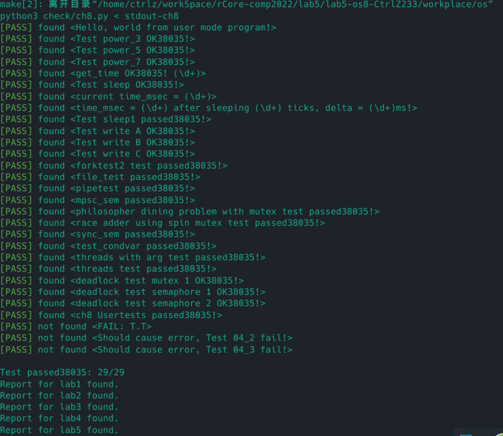

实验报告
在PCB中新增 `is_deadlock_detect_enable` 标志位， `mutex_available` 、`semaphore_available` 、`mutex_need` 、`semaphore_need` 、`mutex_alloc` 、`semaphore_alloc` 向量。

在 create mutex 或 semaphore 时更新 `available` 向量，设置初始值，在 `mutex lock` 和 `semaphore down` 时判断死锁条件，若不通过，则返回`0xdead` ，若 `available` 大于0， 则 `available` 减1，`alloc` 加一，否则， `need` 加一。

在判断死锁条件时，先判断死锁检测开关是否打开，打开才进行死锁检测。
## 实验截图

# 问答题
1. 整个进程退出后，需要回收所有线程的内核栈、用户栈、TRAMPOLINE、进程内的地址空间和物理页框、PID等。其他线程的TCB可能会在TaskManager的队列中、Semaphore和Condvar的等待队列中被引用，此时需要同步清理，因为进程的公共资源已经被回收，如果这些线程被重新调度，可能会产生非法访问。
2. 第一种先解锁，然后弹出等待锁的任务，第二种判断是否由等待的任务，如果有则弹出，否则解锁。在有的时候会导致死锁，因为没有解锁。